# 后端Python与前端网页交互

<br/>

- 使用Flask包，使得前端网页得以展示后端Python执行结果，并也可将用户的反馈发送至后端Python中
- 前端开发使用基于Vue的Vuetify框架，并使用Echarts包绘制图（Graph）
- 开发环境：Windows 10 + VSCode + Postman
- Vuetify开发文档：[https://vuetifyjs.com/zh-Hans/](https://vuetifyjs.com/zh-Hans/)
- Echarts开发文档：[https://echarts.apache.org/zh/index.html](https://echarts.apache.org/zh/index.html)

- 运行命令（在项目根目录中）：
  ```sh
  python BackEnd.py
  cd graphvisual
  npm install
  npm run serve
  ```

<br/>

## 0 准备工作

前端框架vue CLI 3 （安装命令：`npm install -g @vue/cli`）

前端绘图包Echarts（安装命令：`npm install echarts --save`）

前端请求包Axios（安装命令：`npm install axios`）

后端Python包Flask：（安装命令：`pip install flask-restful`）

<br/>

## 1 新建前端项目

1. 新建一个空白文件夹作为项目目录
2. vscode中打开新终端（powershell或cmd），cd进该文件夹
3. 创建vue项目并命名为graphvisual：`vue create graphvisual`，提示选择版本时此处选择默认的Vue 2项目
4. cd进项目文件夹：`cd graphvisual`
5. 添加vuetify框架：`vue add vuetify`，会提示请选择版本，此处选择默认
6. 启动本地网页预览：`npm run serve`，ctrl+c可以结束进程
7. 更详细的vuetify框架介绍、目录文件介绍与开发文档介绍请参考：[https://blog.csdn.net/Ucreate/article/details/120061979](https://blog.csdn.net/Ucreate/article/details/120061979)

<br/>

## 2 编辑绘图页面

### 2.1 Graph.vue文件

在前端工作目录中的src/components下新建Graph.vue文件，粘贴入以下代码：

```javascript
<template>
  <div id="graph" :style="{width: '1000px', height: '600px'}"></div>
</template>

<script>
  import * as echarts from 'echarts';
  export default {
    methods: {
      
      // 绘图
      drawGraph() {
        var chartDom = document.getElementById('graph');
        var myChart = echarts.init(chartDom);
        var option;
        option = {
          title: {
              text: 'Graph 简单示例'
          },
          tooltip: {},
          animationDurationUpdate: 1500,
          animationEasingUpdate: 'quinticInOut',
          series: [{
            type: 'graph',
            layout: 'none',
            symbolSize: 50,
            roam: true,
            label: {
                show: true
            },
            edgeSymbol: ['circle', 'arrow'],
            edgeSymbolSize: [4, 10],
            edgeLabel: {
                fontSize: 20
            },
            data: [{
                name: '节点1',
                x: 300,
                y: 300
            }, {
                name: '节点2',
                x: 800,
                y: 300
            }, {
                name: '节点3',
                x: 550,
                y: 100
            }, {
                name: '节点4',
                x: 550,
                y: 500
            }],
            // links: [],
            links: [{
                source: 0,
                target: 1,
                symbolSize: [5, 20],
                label: {
                    show: true
                },
                lineStyle: {
                    width: 5,
                    curveness: 0.2
                }
            }, {
                source: '节点2',
                target: '节点1',
                label: {
                    show: true
                },
                lineStyle: {
                    curveness: 0.2
                }
            }, {
                source: '节点1',
                target: '节点3'
            }, {
                source: '节点2',
                target: '节点3'
            }, {
                source: '节点2',
                target: '节点4'
            }, {
                source: '节点1',
                target: '节点4'
            }],
            lineStyle: {
                opacity: 0.9,
                width: 2,
                curveness: 0
            }
          }]
        };
        myChart.setOption(option);
      }
    },
    
    // 页面加载时的操作
    mounted(){
      this.drawGraph();
    }
  }
</script>
```

页面加载时将直接执行绘图函数drawGraph()。drawGraph()函数中超长的option部分即为绘图的设置与数据，复制于Echarts开发文档中的demo代码中的option部分：[https://echarts.apache.org/examples/zh/editor.html?c=graph-label-overlap](https://echarts.apache.org/examples/zh/editor.html?c=graph-label-overlap)。

### 2.2 App.vue文件

在前端工作目录中的src文件夹下App.vue中所有代码替换为如下代码：

```javascript
<template>
  <v-app>
    <v-main>
      <Graph/>
    </v-main>
  </v-app>
</template>

<script>
import Graph from './components/Graph';

export default {
  name: 'App',
  components: {
    Graph,
  },
};
</script>
```

即在页面中直接展示2.1节的Graph页面。

启动本地网页预览：`npm run serve`，可以正常显示绘图效果


### 2.3 自定义图显示选项与数据

绘图时选项或参数的说明文档：[https://echarts.apache.org/zh/option.html#series-graph](https://echarts.apache.org/zh/option.html#series-graph)，可阅读并调整至想要的效果，比如将src/components/Graph.vue中的options部分修改如下：

```javascript
option = {
  title: {
    text: 'Graph 自定义示例'
  },
  tooltip: {},
  animationDurationUpdate: 1500,
  animationEasingUpdate: 'quinticInOut',
  series: [{
    type: 'graph',
    layout: 'circular',
    symbolSize: 50,
    roam: true,
    label: {
      show: true
    },
    edgeSymbol: ['circle', 'arrow'],
    edgeSymbolSize: [4, 10],
    edgeLabel: {
      fontSize: 16
    },
    data: [{
        name: '节点1',
      }, {
        name: '节点2',
      }, {
        name: '节点3',
      }, {
        name: '节点4',
    }],
    links: [
      {
        source: '节点2',
        target: '节点1',
        label: {
          show: true,
          formatter: '标签值1'
        },
      }, {
        source: '节点1',
        target: '节点3',
        label: {
          show: true,
          formatter: '标签值2'
        },
      }, {
        source: '节点2',
        target: '节点3'
      }, {
        source: '节点1',
        target: '节点4'
    }],
    lineStyle: {
        opacity: 0.9,
        width: 2,
    }
  }]
};
```

绘图效果如下：

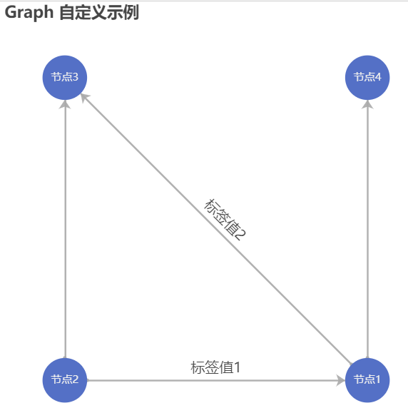

更多关于Vue+Echarts前端绘图的用法，可参考：[https://www.jianshu.com/p/cf0a54374419](https://www.jianshu.com/p/cf0a54374419)

<br/>

## 3 与Python的数据交互

### 3.1 Python Flask

使用Flask开启Python后端服务（BackEnd.py)：

```python
from flask import Flask,request
app = Flask(__name__)

# 浏览器向链接发送Post请求获取数据
@app.route('/getData',methods=['POST'])
def getData():
    return {
            'graph': {
                'nodes': ['Node 1', 'Node 2', 'Node 3', 'Node 4'],  # 节点 id 列表
                'edges': [['Node 2', 'Node 1', 'Edge 1'],           # 表示一条边：[起点、终点、边标签值]      
                          ['Node 1', 'Node 3', 'Edge 2'], 
                          ['Node 2', 'Node 3', 'Edge 3'], 
                          ['Node 1', 'Node 4', 'Edge 4']]
            }
        }

# 浏览器将用户交互结果通过此链接Post至后端
@app.route('/returnResult',methods=['POST'])
def returnResult():
    result = request.form.get('result')
    print(result)
    return "OK"

# 开启服务
if __name__ == '__main__':
    app.run(host='0.0.0.0', port=5000)  # 0.0.0.0代表本机任何地址均可访问
```

此处定义了两个函数 getData() 与 returnResult()，前者返回图的节点与连边信息，后者则从前端接收数据并输出至Python控制台。运行此程序，通过Postman软件发送post请求，结果如下：

- getData()
  
  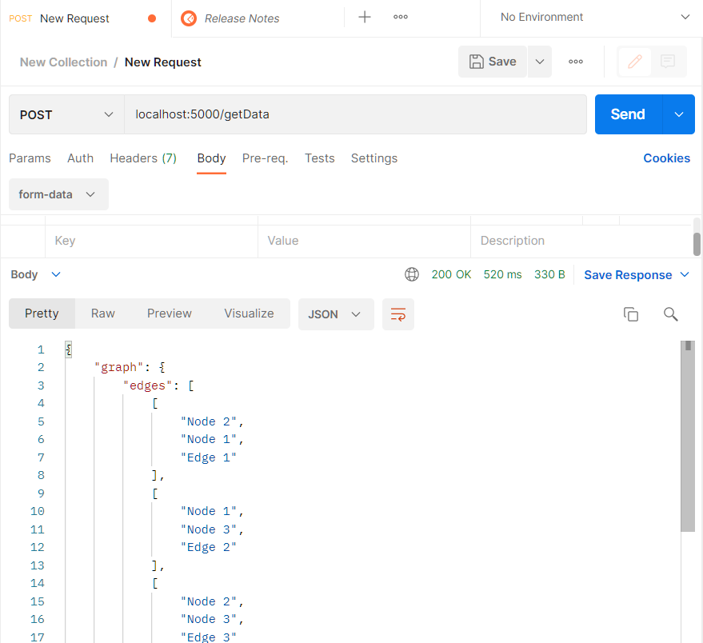
- returnResult()
  
  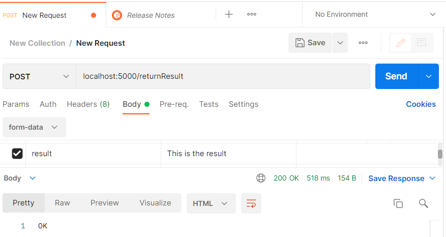
  
  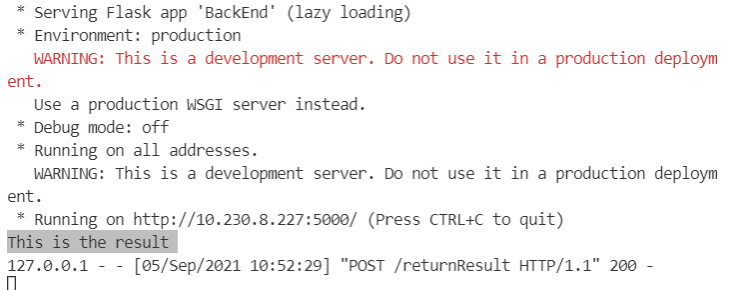

更多关于Flask的用法，可参考:

[https://blog.csdn.net/qq_41500222/article/details/89459946](https://blog.csdn.net/qq_41500222/article/details/89459946)

[https://dev.to/aligoren/building-basic-restful-api-with-flask-restful-57oh](https://dev.to/aligoren/building-basic-restful-api-with-flask-restful-57oh)

[https://jingyan.baidu.com/article/8275fc86be346f07a03cf682.html](https://jingyan.baidu.com/article/8275fc86be346f07a03cf682.html)

<br/>

### 3.2 前端发送Post请求获取图数据

在第2节的基础上，首先对src/components/Graph.vue中的代码进行修改，以本地数据模拟完成转换与绘图，完整代码如下：

```javascript
<template>
  <div id="graph" :style="{width: '1000px', height: '600px'}"></div>
</template>

<script>
  import * as echarts from 'echarts';
  export default {
    data() {
      return {
        nodes: [],
        edges: [],
      }
    },

    methods: {
      // 从 Python 后端获取数据
      getData() {
        // TO DO: 发送Post请求获取数据
        var data = {
          'graph': {
              'nodes': ['Node 1', 'Node 2', 'Node 3', 'Node 4'],  // 节点 id 列表
              'edges': [['Node 2', 'Node 1', 'Edge 1'],           // 表示一条边：[起点、终点、边标签值]      
                        ['Node 1', 'Node 3', 'Edge 2'], 
                        ['Node 2', 'Node 3', 'Edge 3'], 
                        ['Node 1', 'Node 4', 'Edge 4']]
            }
        };
        var inputNodes = data['graph']['nodes'];
        var inputEdges =  data['graph']['edges'];

        // 写入图数据
        this.nodes = [];
        this.edges = [];
        for (let i in inputNodes) 
          this.nodes.push({name: inputNodes[i]});
        for (let i in inputEdges)
          this.edges.push({source: inputEdges[i][0], target: inputEdges[i][1], label: {show: true, formatter: inputEdges[i][2]}});
        
        // 绘图
        this.drawGraph();        
      },

      // 绘图
      drawGraph() {
        var chartDom = document.getElementById('graph');
        var myChart = echarts.init(chartDom);
        var option;
        option = {
          title: {
            text: 'Graph 自定义示例'
          },
          tooltip: {},
          animationDurationUpdate: 1500,
          animationEasingUpdate: 'quinticInOut',
          series: [{
            type: 'graph',
            layout: 'circular',
            symbolSize: 50,
            roam: true,
            label: {
              show: true
            },
            edgeSymbol: ['circle', 'arrow'],
            edgeSymbolSize: [4, 10],
            edgeLabel: {
              fontSize: 16
            },
            data: this.nodes,
            links: this.edges,
            lineStyle: {
                opacity: 0.9,
                width: 2,
            }
          }]
        };
        myChart.setOption(option);
      }
    },
    
    // 页面加载时的操作
    mounted(){
      this.getData();
    }
  }
</script>
```

当前代码中共有两个方法（methods），getData()方法中还需要完成Post请求的发送，而drawGraph()方法则是第2节中已完成的代码，只是将数据来源更改为全局变量this.nodes与this.edges。运行代码，浏览器中绘图结果如下：

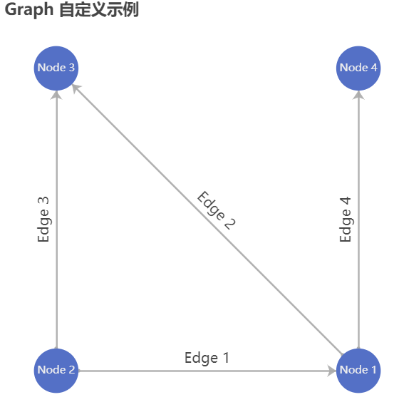

接下来，在getData()方法中，使用axios包发送Post请求获取图数据。

首先，需要在Vue的配置文件中写入链接，即在vue.config.js文件内容如下：

```json5
module.exports = {
  transpileDependencies: [
    'vuetify'
  ],

  devServer: {
    proxy: {
      '/': {                              // 用于前端开发的接口请求抽象地址
        changeOrigin: true,               // 允许跨域
        target: 'http://localhost:5000/'  // 后端接收请求的地址
      },
    }
  }
}
```

注意此处我们刚刚运行中的Python后端与前端在同一台电脑中，因此后端接收请求的地址与3.1节一致，均为'http://localhost:5000/'。而当部署上线时，Python后端在远程服务器中时，后端接收请求的地址需要更改为服务器的地址及端口，同时记得在服务器中开放该端口的外部访问权限。

第二步，需要引入axios包，回到src/components/Graph.vue文件中的第7行加入 `import axios from 'axios'`。即：

```javascript
import * as echarts from 'echarts';
import axios from 'axios';
export default {
...
```

第三步，修改src/components/Graph.vue文件中的getData()方法，代码如下：

```javascript
// 从 Python 后端获取数据
getData() {
  // 发送Post请求获取数据
  let that = this;
  axios.post('getData').then(function (response) {
    var graph = response.data.graph;
    var inputNodes = graph.nodes;
    var inputEdges =  graph.edges;

    // 写入图数据
    that.nodes = [];
    that.edges = [];
    for (let i in inputNodes) 
      that.nodes.push({name: inputNodes[i]});
    for (let i in inputEdges)
      that.edges.push({source: inputEdges[i][0], target: inputEdges[i][1], label: {show: true, formatter: inputEdges[i][2]}});
    
    // 绘图
    that.drawGraph();  
  })
  .catch(function (error) {
    console.log(error);
  });      
},
```

最后启动本地网页预览：`npm run serve`，浏览器中效果如下：

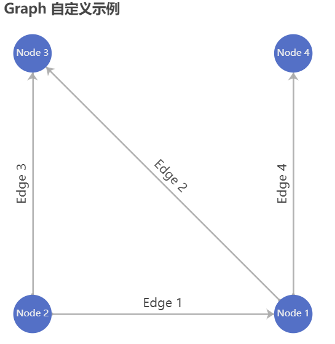

### 3.3 前端向Python后端返回结果

在前端代码src/components/Graph.vue中增加向Python后端返回结果的函数returnResult()，并添加至页面加载时的mounted动作中。此处向后端返回了'This is a result'字符串。完整代码如下：

```javascript
<template>
  <div id="graph" :style="{width: '1000px', height: '600px'}"></div>
</template>

<script>
  import * as echarts from 'echarts';
  import axios from 'axios';
  export default {
    data() {
      return {
        nodes: [],
        edges: [],
      }
    },

    methods: {
      
      // 从 Python 后端获取数据
      getData() {
        // 发送Post请求获取数据
        let that = this;
        axios.post('getData').then(function (response) {
          var graph = response.data.graph;
          var inputNodes = graph.nodes;
          var inputEdges =  graph.edges;

          // 写入图数据
          that.nodes = [];
          that.edges = [];
          for (let i in inputNodes) 
            that.nodes.push({name: inputNodes[i]});
          for (let i in inputEdges)
            that.edges.push({source: inputEdges[i][0], target: inputEdges[i][1], label: {show: true, formatter: inputEdges[i][2]}});
          
          // 绘图
          that.drawGraph();  
        })
        .catch(function (error) {
          console.log(error);
        });      
      },

      // 向Python后端发送结果
      returnResult() {
        axios.post('returnResult', {
          result: 'This is a result'
        },{
          headers: {'Content-Type': 'application/json'}
        })
        .then(function (response) {
          console.log(response.data);
        })
        .catch(function (error) {
          console.log(error);
        });
      },

      // 绘图
      drawGraph() {
        var chartDom = document.getElementById('graph');
        var myChart = echarts.init(chartDom);
        var option;
        option = {
          title: {
            text: 'Graph 自定义示例'
          },
          tooltip: {},
          animationDurationUpdate: 1500,
          animationEasingUpdate: 'quinticInOut',
          series: [{
            type: 'graph',
            layout: 'circular',
            symbolSize: 50,
            roam: true,
            label: {
              show: true
            },
            edgeSymbol: ['circle', 'arrow'],
            edgeSymbolSize: [4, 10],
            edgeLabel: {
              fontSize: 16
            },
            data: this.nodes,
            links: this.edges,
            lineStyle: {
                opacity: 0.9,
                width: 2,
            }
          }]
        };
        myChart.setOption(option);
      }
    },

    // 页面加载时的操作
    mounted(){
      this.getData();
      this.returnResult();
    }
  }
</script>
```

后端Python代码由于涉及到字符串类型转换，因此接收结果的函数returnResult()也需要修改，BackEnd.py完整代码如下：

```python
import json
from flask import Flask,request
app = Flask(__name__)

# 浏览器向链接发送Post请求获取数据
@app.route('/getData',methods=['POST'])
def getData():
    return {
            'graph': {
                'nodes': ['Node 1', 'Node 2', 'Node 3', 'Node 4'],  # 节点 id 列表
                'edges': [['Node 2', 'Node 1', 'Edge 1'],           # 表示一条边：[起点、终点、边标签值]      
                          ['Node 1', 'Node 3', 'Edge 2'], 
                          ['Node 2', 'Node 3', 'Edge 3'], 
                          ['Node 1', 'Node 4', 'Edge 4']]
            }
        }

# 浏览器将用户交互结果通过此链接Post至后端
@app.route('/returnResult',methods=['POST'])
def returnResult():
    jsonResult = str(request.get_data(), "utf8")
    result = json.loads(jsonResult).get('result')
    print(result)
    return "OK"

# 开启服务
if __name__ == '__main__':
    app.run(host='0.0.0.0', port=5000)  # 0.0.0.0代表本机任何地址均可访问
```

分别开启前端与后端服务后，前端可以加载出图，并向后端返回'This is a result'字符串：

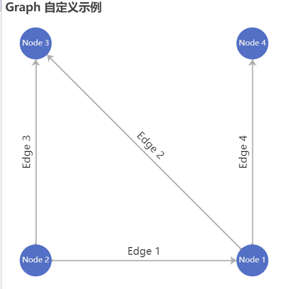

后端Python接收到了返回值，并打印于控制台中：

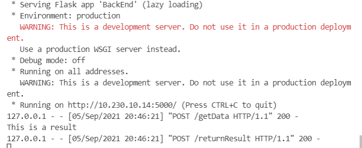

更多关于前端axios请求的方法，可以参考Axios开发文档：[http://www.axios-js.com/zh-cn/docs/#axios-put-url-data-config-1](http://www.axios-js.com/zh-cn/docs/#axios-put-url-data-config-1)

关于axios请求的相关踩坑参考链接：

[https://www.cnblogs.com/chr506029589/p/12987356.html](https://www.cnblogs.com/chr506029589/p/12987356.html)

[https://www.jianshu.com/p/94e09847dcb3](https://www.jianshu.com/p/94e09847dcb3)

[https://blog.csdn.net/wangping146/article/details/85983286](https://blog.csdn.net/wangping146/article/details/85983286)

<br/>

## 4 页面优化与按钮交互

在第3.2节中已经实现了Python后端向前端发送图数据并在前端渲染，第3.3节也实现了前端向后端返回字符串数组。本节进一步丰富前后端通信的内容，后端可以向前端发送查询id、文本描述与候选选项等，而前端可以向后端返回该查询id及其选项答案。

### 4.1 添加变量

添加接下来程序中必要的变量，并加入前后端Post请求的通信中，src/components/Graph.vue完整代码如下：

```javascript
<template>
  <div id="graph" :style="{width: '1000px', height: '600px'}"></div>
</template>

<script>
  import * as echarts from 'echarts';
  import axios from 'axios';
  export default {
    data() {
      return {
        userid: null,
        nodes: [],
        edges: [],
        queryid: 0,
        text: null,
        options: ["NULL"],
      }
    },

    methods: {
      
      // 从 Python 后端获取数据
      getData() {
        // 发送Post请求获取数据
        let that = this;
        axios.post('getData', {
          userid: this.userid,
        }).then(function (response) {
          // 写入图数据
          var graph = response.data.graph;
          var inputNodes = graph.nodes;
          var inputEdges =  graph.edges;
          that.nodes = [];
          that.edges = [];
          for (let i in inputNodes) 
            that.nodes.push({name: inputNodes[i]});
          for (let i in inputEdges)
            that.edges.push({source: inputEdges[i][0], target: inputEdges[i][1], label: {show: true, formatter: inputEdges[i][2]}});
          // 绘图
          that.drawGraph();  
          // 更新当前选项
          that.options = response.data.options;
          // 更新当前文本
          that.text = response.data.text;
          // 更新当前查询图的id
          that.queryid = response.data.queryid;
        })
        .catch(function (error) {
          console.log(error);
        });      
      },

      // 向Python后端发送结果
      returnResult() {
        axios.post('returnResult', {
          result: 'This is a result',
          queryid: this.queryid,
          userid: this.userid
        },{
          headers: {'Content-Type': 'application/json'}
        })
        .then(function (response) {
          console.log(response.data);
        })
        .catch(function (error) {
          console.log(error);
        });
      },

      // 绘图
      drawGraph() {
        var chartDom = document.getElementById('graph');
        var myChart = echarts.init(chartDom);
        var option;
        option = {
          tooltip: {},
          animationDurationUpdate: 1500,
          animationEasingUpdate: 'quinticInOut',
          series: [{
            type: 'graph',
            layout: 'circular',
            symbolSize: 100,
            roam: true,
            label: {
              show: true,
              width: 100,
              overflow: "break"
            },
            edgeSymbol: ['circle', 'arrow'],
            edgeSymbolSize: [4, 16],
            edgeLabel: {
              fontSize: 12,
              width: 150,
              overflow: "break"
            },
            data: this.nodes,
            links: this.edges,
            lineStyle: {
              opacity: 0.9,
              width: 2,
            }
          }]
        };
        myChart.setOption(option);
      }
    },

    // 页面加载时的操作
    mounted(){
      this.getData();
      this.returnResult();      
    }
  }
</script>
```

BackEnd.py完整代码：

```javascript
import json
from flask import Flask,request
app = Flask(__name__)

# 浏览器向链接发送Post请求获取数据
@app.route('/getData',methods=['POST'])
def getData():
    responseDict = json.loads(str(request.get_data(), "utf8"))
    userid = responseDict.get('userid')
    print("userid: "+str(userid))
    return {
            'graph': {
                'nodes': ['Node 1', 'Node 2', 'Node 3', 'Node 4'],  # 节点 id 列表
                'edges': [['Node 2', 'Node 1', 'Edge 1'],           # 表示一条边：[起点、终点、边标签值]      
                          ['Node 1', 'Node 3', 'Edge 2'], 
                          ['Node 2', 'Node 3', 'Edge 3'], 
                          ['Node 1', 'Node 4', 'Edge 4']]
            },
            'options': ["Option 1", "Option 2", "Option 3"],
            'queryid': "111",
            'text': "This is some description text."
        }

# 浏览器将用户交互结果通过此链接Post至后端
@app.route('/returnResult',methods=['POST'])
def returnResult():
    responseDict = json.loads(str(request.get_data(), "utf8"))
    result = responseDict.get('result')
    userid = responseDict.get('userid')
    queryid = responseDict.get('queryid')
    print("result: "+str(result))
    print("userid: "+str(userid))
    print("queryid: "+str(queryid))
    return "OK"


# 开启服务
if __name__ == '__main__':
    app.run(host='0.0.0.0', port=5000)  # 0.0.0.0代表本机任何地址均可访问
```

<br/>

### 4.2 前端页面布局与按钮

在布局中增加了标题、用户ID、来自Python后端的文本以及供选择的按钮，另外也调整了图绘制的部分选项。src/components/Graph.vue完整代码如下：

```javascript
<template>
  <v-container class="flex justify-center mt-2">
    <v-card class="px-4">
      <v-toolbar flat>
        <span class="text-h5">标题</span>
        <v-spacer/>
        <span v-text="'用户ID: '+userid"/>
      </v-toolbar>
      <v-divider/>
      <div id="graph" :style="{width: '800px', height: '480px'}"></div>
      <v-divider/>
      <v-card-text v-text="text" class="black--text"/>
      <v-card-text>
        <template v-for="(option, index) in options">
          <v-btn :key="index" class="mr-8" outlined color="grey darken-2">{{option}}</v-btn>
        </template>
      </v-card-text>
    </v-card>
  </v-container>
</template>

<script>
  import * as echarts from 'echarts';
  import axios from 'axios';
  export default {
    data() {
      return {
        userid: null,
        nodes: [],
        edges: [],
        queryid: 0,
        text: null,
        options: ["NULL"],
      }
    },

    methods: {
      
      // 从 Python 后端获取数据
      getData() {
        // 发送Post请求获取数据
        let that = this;
        axios.post('getData', {
          userid: this.userid,
        }).then(function (response) {
          // 写入图数据
          var graph = response.data.graph;
          var inputNodes = graph.nodes;
          var inputEdges =  graph.edges;
          that.nodes = [];
          that.edges = [];
          for (let i in inputNodes) 
            that.nodes.push({name: inputNodes[i]});
          for (let i in inputEdges)
            that.edges.push({source: inputEdges[i][0], target: inputEdges[i][1], label: {show: true, formatter: inputEdges[i][2]}});
          // 绘图
          that.drawGraph();  
          // 更新当前选项
          that.options = response.data.options;
          // 更新当前文本
          that.text = response.data.text;
          // 更新当前查询图的id
          that.queryid = response.data.queryid;
        })
        .catch(function (error) {
          console.log(error);
        });      
      },

      // 向Python后端发送结果
      returnResult() {
        axios.post('returnResult', {
          result: 'This is a result',
          queryid: this.queryid,
          userid: this.userid
        },{
          headers: {'Content-Type': 'application/json'}
        })
        .then(function (response) {
          console.log(response.data);
        })
        .catch(function (error) {
          console.log(error);
        });
      },

      // 绘图
      drawGraph() {
        var chartDom = document.getElementById('graph');
        var myChart = echarts.init(chartDom);
        var option;
        option = {
          tooltip: {},
          animationDurationUpdate: 1500,
          animationEasingUpdate: 'quinticInOut',
          series: [{
            type: 'graph',
            layout: 'circular',
            symbolSize: 100,
            roam: true,
            label: {
              show: true,
              width: 100,
              overflow: "break"
            },
            edgeSymbol: ['circle', 'arrow'],
            edgeSymbolSize: [4, 16],
            edgeLabel: {
              fontSize: 12,
              width: 150,
              overflow: "break"
            },
            data: this.nodes,
            links: this.edges,
            lineStyle: {
              opacity: 0.9,
              width: 2,
            }
          }]
        };
        myChart.setOption(option);
      }
    },

    // 页面加载时的操作
    mounted(){
      this.getData();
      this.returnResult();      
    },

    // 页面变量深度监听，可监听到对象、数组的变化
    watch:{
      options:{
        handler(val){
          this.options = val;
        },
        deep:true     // 深度监听
      }
    }
  }
</script>
```

值得注意的是，由于按钮的值可能会有变化，因此需要加入最后的watch监听功能，根据按钮数组（options）的实时取值显示。运行后浏览器显示效果如下：

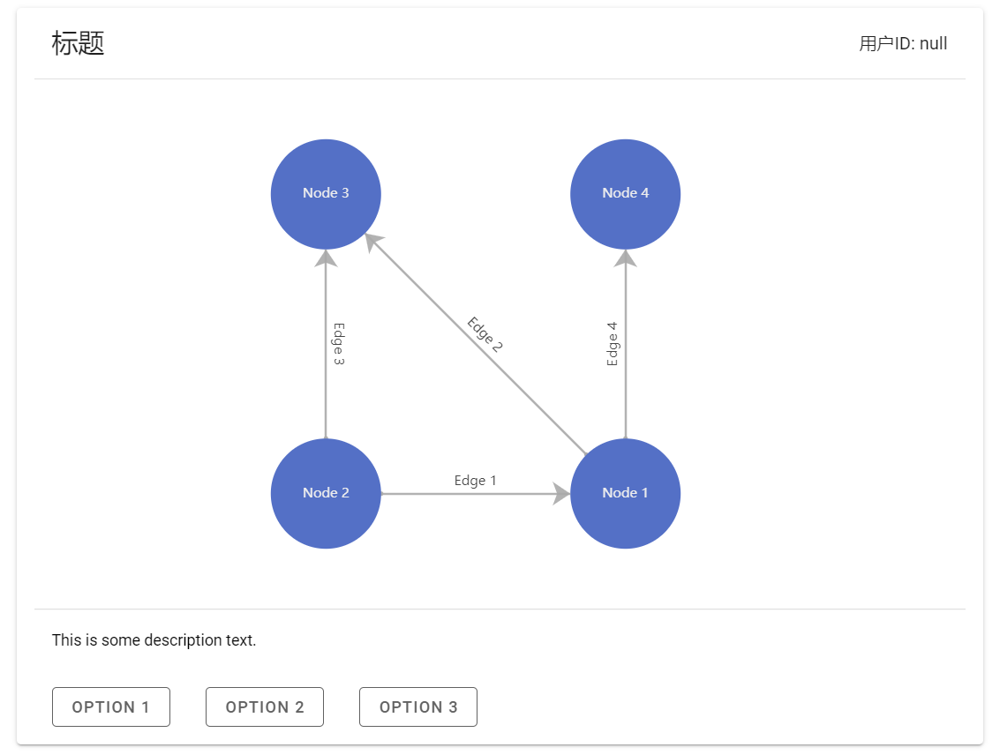

<br/>

### 4.3 按钮与返回结果绑定

在代码中更新了returnResult函数，使其能向后端传回参数option，并在前端中的按钮（v-btn）组件中绑定了returnResult(option)函数事件，当点击某个选项时该选项的文本将会被返回至后端。另外，也为其他变量变量添加深度监听函数，以监测其变化保证显示信息正确。src/components/Graph.vue完整代码如下：

```javascript
<template>
  <v-container class="flex justify-center mt-2">
    <v-card class="px-4">
      <v-toolbar flat>
        <span class="text-h5">标题</span>
        <v-spacer/>
        <span v-text="'用户ID: '+userid"/>
      </v-toolbar>
      <v-divider/>
      <div id="graph" :style="{width: '800px', height: '480px'}"></div>
      <v-divider/>
      <v-card-text v-text="text" class="black--text"/>
      <v-card-text>
        <template v-for="(option, index) in options">
          <v-btn :key="index" class="mr-8" outlined color="grey darken-2" @click="returnResult(option)">{{option}}</v-btn>
        </template>
      </v-card-text>
    </v-card>
  </v-container>
</template>

<script>
  import * as echarts from 'echarts';
  import axios from 'axios';
  export default {
    data() {
      return {
        userid: null,
        nodes: [],
        edges: [],
        queryid: 0,
        text: null,
        options: ["NULL"],
      }
    },

    methods: {
      
      // 从 Python 后端获取数据
      getData() {
        // 发送Post请求获取数据
        let that = this;
        axios.post('getData', {
          userid: this.userid,
        }).then(function (response) {
          // 写入图数据
          var graph = response.data.graph;
          var inputNodes = graph.nodes;
          var inputEdges =  graph.edges;
          that.nodes = [];
          that.edges = [];
          for (let i in inputNodes) 
            that.nodes.push({name: inputNodes[i]});
          for (let i in inputEdges)
            that.edges.push({source: inputEdges[i][0], target: inputEdges[i][1], label: {show: true, formatter: inputEdges[i][2]}});
          // 绘图
          that.drawGraph();  
          // 更新当前选项
          that.options = response.data.options;
          // 更新当前文本
          that.text = response.data.text;
          // 更新当前查询图的id
          that.queryid = response.data.queryid;
        })
        .catch(function (error) {
          console.log(error);
        });      
      },

      // 向Python后端发送结果
      returnResult(option) {
        let that = this;
        axios.post('returnResult', {
          result: option,
          queryid: this.queryid,
          userid: this.userid
        },{
          headers: {'Content-Type': 'application/json'}
        })
        .then(function (response) {
          console.log(response.data);
          that.getData();
        })
        .catch(function (error) {
          console.log(error);
        });
      },

      // 绘图
      drawGraph() {
        var chartDom = document.getElementById('graph');
        var myChart = echarts.init(chartDom);
        var option;
        option = {
          tooltip: {},
          animationDurationUpdate: 1500,
          animationEasingUpdate: 'quinticInOut',
          series: [{
            type: 'graph',
            layout: 'circular',
            symbolSize: 100,
            roam: true,
            label: {
              show: true,
              width: 100,
              overflow: "break"
            },
            edgeSymbol: ['circle', 'arrow'],
            edgeSymbolSize: [4, 16],
            edgeLabel: {
              fontSize: 12,
              width: 150,
              overflow: "break"
            },
            data: this.nodes,
            links: this.edges,
            lineStyle: {
              opacity: 0.9,
              width: 2,
            }
          }]
        };
        myChart.setOption(option);
      }
    },

    // 页面加载时的操作
    mounted(){
      this.getData();      
    },

    // 页面变量深度监听，可监听到对象、数组的变化
    watch:{
      options:{
        handler(val){
          this.options = val;
        },
        deep:true     // 深度监听
      },
      userid:{
        handler(val){
          this.userid = val;
        },
        deep:true     // 深度监听
      },
      queryid:{
        handler(val){
          this.queryid = val;
        },
        deep:true     // 深度监听
      },
      text:{
        handler(val){
          this.text = val;
        },
        deep:true     // 深度监听
      },
      nodes:{
        handler(val){
          this.nodes = val;
        },
        deep:true     // 深度监听
      },
      edges:{
        handler(val){
          this.edges = val;
        },
        deep:true     // 深度监听
      }
    }
  }
</script>
```

刷新网页时，首先会通过getData()函数获取图数据、查询ID以及选项列表等必要数据。当用户选择某个选项后，前端会将选项文本通过returnResult函数返回至Python后端，待Python后端确认请求成功后再次调用getData()函数获取下一个图、ID及选项等，往复循环。轮流点击三个选项，后端Python控制台日志如下：

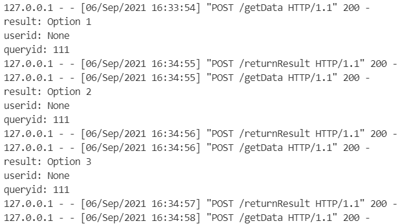

<br/>

### 4.4 用户ID输入弹窗

在用户打开页面时，首先弹窗要求用户输入其ID并缓存在页面中，从而可以在调用getData与returnResult函数时向后端发送其ID信息。代码中页面布局中加入了用户ID输入模块，并根据showUserIdEditor变量决定其是否显示。方法中加入了saveUserId()函数，以关闭窗口并调用getData()函数获取数据。src/components/Graph.vue完整代码如下：

```javascript
<template>
  <v-container class="flex justify-center mt-2">
    <v-card class="px-4">
      <v-toolbar flat>
        <span class="text-h5">标题</span>
        <v-spacer/>
        <span v-text="'用户ID: '+userid"/>
      </v-toolbar>
      <v-divider/>
      <div v-if="showUserIdEditor">
        <v-card-text style="width:300px">
          <v-text-field
            v-model="userid"
            label="您的用户ID"
          ></v-text-field>
        </v-card-text>
        <v-card-actions>
          <v-btn outlined color="grey darken-2" @click="saveUserId" class="mb-8">确认</v-btn>
        </v-card-actions>
      </div>
      <div v-else>
        <div id="graph" :style="{width: '800px', height: '480px'}"></div>
        <v-divider/>
        <v-card-text v-text="text" class="black--text"/>
        <v-card-text>
          <template v-for="(option, index) in options">
            <v-btn :key="index" class="mr-8" outlined color="grey darken-2" @click="returnResult(option)">{{option}}</v-btn>
          </template>
        </v-card-text>
      </div>
    </v-card>
  </v-container>
</template>

<script>
  import * as echarts from 'echarts';
  import axios from 'axios';
  export default {
    data() {
      return {
        userid: null,
        nodes: [],
        edges: [],
        queryid: 0,
        text: null,
        options: ["NULL"],
        showUserIdEditor: true,
      }
    },

    methods: {

      // 保存用户ID，关闭输入框后获取数据
      saveUserId() {
        this.showUserIdEditor = false;
        this.getData();
      },
      
      // 从 Python 后端获取数据
      getData() {
        // 发送Post请求获取数据
        let that = this;
        axios.post('getData', {
          userid: this.userid,
        }).then(function (response) {
          // 写入图数据
          var graph = response.data.graph;
          var inputNodes = graph.nodes;
          var inputEdges =  graph.edges;
          that.nodes = [];
          that.edges = [];
          for (let i in inputNodes) 
            that.nodes.push({name: inputNodes[i]});
          for (let i in inputEdges)
            that.edges.push({source: inputEdges[i][0], target: inputEdges[i][1], label: {show: true, formatter: inputEdges[i][2]}});
          // 绘图
          that.drawGraph();  
          // 更新当前选项
          that.options = response.data.options;
          // 更新当前文本
          that.text = response.data.text;
          // 更新当前查询图的id
          that.queryid = response.data.queryid;
        })
        .catch(function (error) {
          console.log(error);
        });      
      },

      // 向Python后端发送结果
      returnResult(option) {
        let that = this;
        axios.post('returnResult', {
          result: option,
          queryid: this.queryid,
          userid: this.userid
        },{
          headers: {'Content-Type': 'application/json'}
        })
        .then(function (response) {
          console.log(response.data);
          that.getData();
        })
        .catch(function (error) {
          console.log(error);
        });
      },

      // 绘图
      drawGraph() {
        var chartDom = document.getElementById('graph');
        var myChart = echarts.init(chartDom);
        var option;
        option = {
          tooltip: {},
          animationDurationUpdate: 1500,
          animationEasingUpdate: 'quinticInOut',
          series: [{
            type: 'graph',
            layout: 'circular',
            symbolSize: 100,
            roam: true,
            label: {
              show: true,
              width: 100,
              overflow: "break"
            },
            edgeSymbol: ['circle', 'arrow'],
            edgeSymbolSize: [4, 16],
            edgeLabel: {
              fontSize: 12,
              width: 150,
              overflow: "break"
            },
            data: this.nodes,
            links: this.edges,
            lineStyle: {
              opacity: 0.9,
              width: 2,
            }
          }]
        };
        myChart.setOption(option);
      }
    },

    // 页面加载时的操作
    mounted(){
      this.getData();      
    },

    // 页面变量深度监听，可监听到对象、数组的变化
    watch:{
      options:{
        handler(val){
          this.options = val;
        },
        deep:true     // 深度监听
      },
      userid:{
        handler(val){
          this.userid = val;
        },
        deep:true     // 深度监听
      },
      queryid:{
        handler(val){
          this.queryid = val;
        },
        deep:true     // 深度监听
      },
      text:{
        handler(val){
          this.text = val;
        },
        deep:true     // 深度监听
      },
      nodes:{
        handler(val){
          this.nodes = val;
        },
        deep:true     // 深度监听
      },
      edges:{
        handler(val){
          this.edges = val;
        },
        deep:true     // 深度监听
      },
      showUserIdEditor:{
        handler(val){
          this.showUserIdEditor = val;
        },
        deep:true     // 深度监听
      }
    }
  }
</script>
```

运行或刷新前端页面后，首先显示的是用户ID输入框：

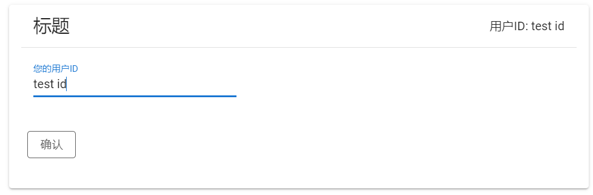

输入ID并点击确定按钮后，调用getData()方法获取数据并显示：


此时Python后端获取到了用户的ID信息：

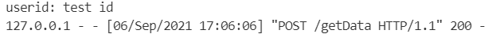

选择某个选项后，前端网页传回选项并请求加载新的数据，此时后端也获取了上个查询的结果以及其他必要信息：

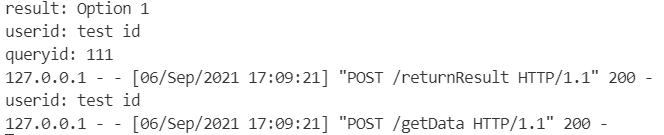